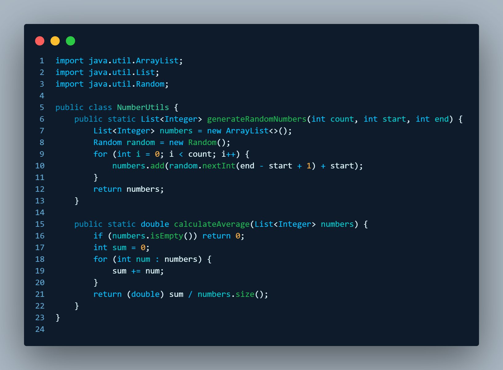
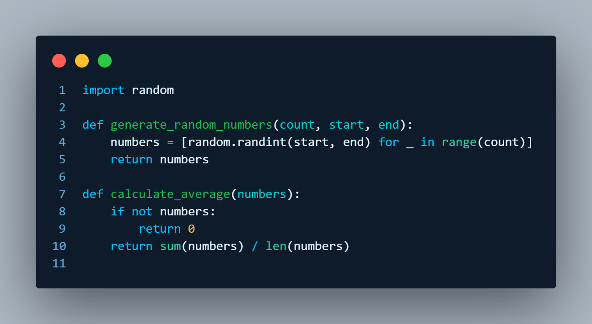
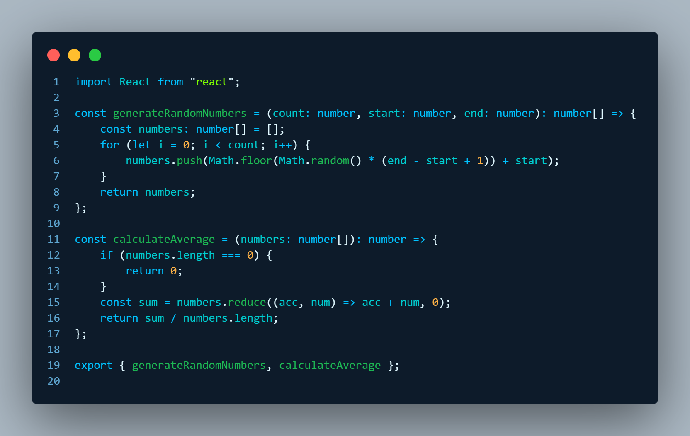
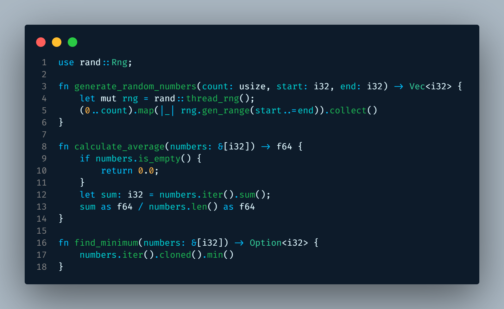

# 🌙 Frutiger Aero Dark — VS Code Theme

> A dark, glossy theme inspired by the iconic **Frutiger Aero** aesthetic.  
> Vibrant colors, soft glassy contrasts, and a clean futuristic feel from the golden era of tech (2000s vibes, reimagined).

---

## 🎨 Color Palette

- 🖤 **Background**: `#0D1B2A`
- ✨ **Foreground**: `#E0F8FF`
- 🌊 **Accent Cyan**: `#00C2FF`
- 🍃 **Bright Green**: `#7CFC00`
- 🍊 **Soft Orange**: `#FFB347`
- 🧠 **Comments**: `#5FA8D3` (italic)
- 💡 **Functions**: `#1DB954`
- 🧬 **Variables**: `#00CED1`

---

## 🧠 Language Support

Frutiger Aero Dark has full support for the most popular programming and scripting languages:

| Language         | Supported |
|------------------|-----------|
| JavaScript / TypeScript | ✅ |
| JSX / TSX (React)        | ✅ |
| HTML / CSS / SCSS        | ✅ |
| PHP / Python / Rust      | ✅ |
| Java / C# / Go           | ✅ |
| SQL / JSON / YAML        | ✅ |
| Bash / Shell / Dockerfile| ✅ |
| Markdown                 | ✅ |
| Vue / Astro / Laravel Blade | ✅ |

---

## ✨ UI Customizations

Beyond syntax, the theme customizes key parts of the VS Code interface:

- Status bar, Activity bar, Sidebar
- Terminal background
- Git diff colors
- Selections, cursor, highlights
- Tooltips, popups, and more

---

## 🖼️ Screenshots

> A sneak peek of Frutiger Aero Dark in action across different languages:

### ☕ Java



---

### 🐍 Python



---

### ⚛️ React (JSX/TSX)



---

### 💎 Ruby



---

> 💡 All code samples were rendered with the glossy, fresh, and vibrant touch of Aero.

## 📦 Installation

### From Marketplace (coming soon)
Search for `Frutiger Aero Dark` in the [Extensions panel](vscode:extension).

### Manual Install

```bash
vsce package
code --install-extension frutiger-aero-dark-0.0.1.vsix
